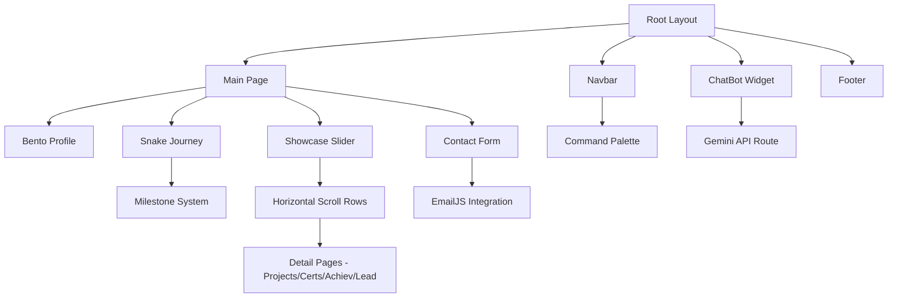

# Professional Next.js Portfolio - Harshil Patel

A state-of-the-art, interactive portfolio website built with **Next.js 15+**, **TypeScript**, and **Framer Motion**. This project features a unique "Bento" design, a dynamic "Snake" journey timeline, a cascading "Showcase" slider, and an AI-powered personal assistant.

---

## 🏗️ Project Architecture

The architecture follows a modular, component-based approach within the Next.js App Router framework.



---

## 🌟 Key Features & Algorithms

### 1. Unified Snake Journey
A continuous, multi-row SVG timeline that maps milestones onto a snake-like path.
- **Algorithm**: The path is calculated based on `NUM_ROWS` and `ROW_HEIGHT`. It uses a dynamic SVG string builder to create the "U-turns" at the end of each row.
- **Milestone Mapping**: Milestones are positioned using an absolute "Row Unit" system, ensuring they stay perfectly aligned even if the road length changes.
- **Interactive Car**: A motion-tracked "Car" indicator follows the user's scroll progress using `useScroll` and `useTransform`.

### 2. Cascading Showcase Slider
A horizontal-in-vertical scroll experience that separates content into distinct "territories" (Projects, Achievements, etc.).
- **Sticky Locking**: Each category row "sticks" to the top of the viewport using `sticky` positioning and `h-[250vh]` containers.
- **Transformation**: Vertical scroll progress is mapped directly to horizontal translation (`x: -100%`) using Framer Motion.
- **Vertical progress Map**: A persistent navigation spine on the left tracks the category progress as you scroll.

### 3. AI Personal Assistant (Gemini)
A built-in chatbot that knows everything about Harshil's professional life.
- **Context Injection**: The `buildChatContext()` utility scrapes the entire `data.ts` to create a dense system prompt for the AI.
- **Model**: Powered by **Gemini 2.5 Flash** for high-speed, intelligent responses.
- **Streaming UI**: Features a sleek, floating widget with message history and navigation commands (e.g., "Take me to projects").

### 4. Interactive Certification Vault
A dedicated system for viewing professional credentials.
- **A4 Optimization**: Embedded PDF viewers are forced to a **1.414:1 aspect ratio** to eliminate internal scrollbars for certificates.
- **Course Detail Sub-pages**: Every item has its own deep-linkable page with metadata, outcomes, and LinkedIn social proof.

---

## 🛠️ Tech Stack & Requirements

### Core Frameworks
- **Primary**: [Next.js 15+](https://nextjs.org/) (App Router)
- **Language**: [TypeScript](https://www.typescriptlang.org/)
- **Styling**: [Tailwind CSS 4](https://tailwindcss.com/)
- **Animations**: [Framer Motion](https://www.framer.com/motion/)
- **Icons**: [Lucide React](https://lucide.dev/)

### Extensions & Integrations
- **AI**: Google Generative AI (@google/generative-ai)
- **Mail**: EmailJS (@emailjs/browser)
- **Intersection Observer**: For scroll-triggered entry animations.
- **Themes**: next-themes (Dark/Light mode support).

### Setup Requirements
- **Node.js**: 18.x or higher.
- **VS Code Extensions**: 
    - ES7+ React/Redux/React-Native snippets
    - Tailwind CSS IntelliSense
    - Prettier - Code formatter

---

## 🎨 UI/UX Design Philosophy

- **Glassmorphism**: Heavy use of `backdrop-blur` and semi-transparent borders for a premium, clean aesthetic.
- **Bento Grid**: The "Profile" section utilizes a responsive grid that organizes disparate info (Skills, Bio, Experience) into a unified, scanned-at-a-glance layout.
- **Dynamic Micro-animations**: Hover effects on all cards, rotating gradients on active buttons, and smooth transition states between pages.
- **Mobile First**: Responsive layouts that gracefully degrade from complex horizontal scrolls to vertical stacks on mobile devices.

---

## 🚀 Recent Improvements
Recent iterations have significantly refined the portfolio:
- **EmailJS Integration**: The contact form is fully functional, sending real emails directly to the owner.
- **Profile Rebrand**: Renamed the core bio section to "Profile" for better user identification.
- **Responsive Navbar**: The "Quick Navigate" search bar is centered and enlarged for better accessibility.
- **Social Proofing**: Integrated "View LinkedIn Post" buttons on all detail pages.

---

## ⚙️ How to Setup (Replicate)

1. **Clone the Repo**:
   ```bash
   git clone [your-repo-ui]
   cd portfolio
   ```

2. **Setup .env.local**:
   Create a `.env.local` file with the following keys:
   ```env
   GEMINI_API_KEY=your_gemini_key
   NEXT_PUBLIC_EMAILJS_SERVICE_ID=your_id
   NEXT_PUBLIC_EMAILJS_TEMPLATE_ID=your_id
   NEXT_PUBLIC_EMAILJS_PUBLIC_KEY=your_key
   ```

3. **Install & Run**:
   ```bash
   npm install
   npm run dev
   ```

4. **Customize Data**:
   All portfolio content is centralized in `src/lib/data.ts`. Simply update the objects in this file to change the website's content!

---

Built with ❤️ by Harshil Patel & Antigravity AI
